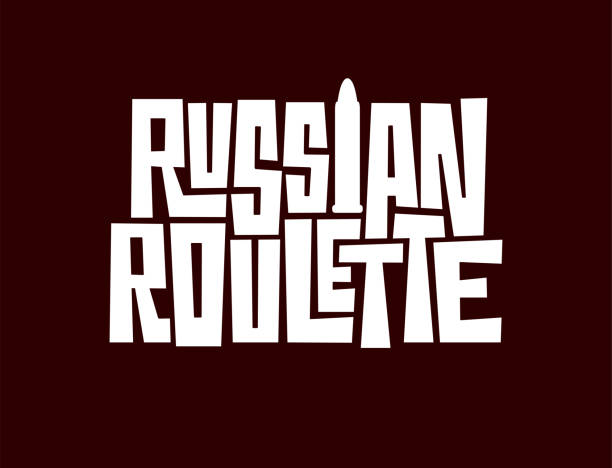

# Russian Roulette Game



This is a Java implementation of the Russian Roulette game, where the player and a virtual dealer take turns to shoot themselves or each other with a revolver containing one live bullet and several blanks. The game continues until one of them loses all their lives.

## Features

- Player can shoot themselves or the dealer.
- Dealer's moves are randomly generated.
- God mode allows the player to see the contents of the revolver chamber.
- Score multiplier increases with each round won.
- Option to double score after winning a round.

## How to Play

- Enter your first name and your signature to participate in the game.
- Choose 's' to shoot yourself or 'd' to shoot the dealer.
- Survive longer than the dealer to win the game.

## Usage

- Clone the repository.

    ```bash
    git clone https://github.com/KarthikUdyawar/RussianRoulette.git
    ```

- Navigate to the src directory.

    ```bash
    cd RussianRoulette/src
    ```

- Compile the Java file:

    ```bash
    javac App.java
    ```

- Run the compiled file:

    ```bash
    java App
    ```

## Contributing

If you'd like to contribute to this project, feel free to fork the repository and submit a pull request.

## License

This project is licensed under the Apache License - see the LICENSE file for details.
